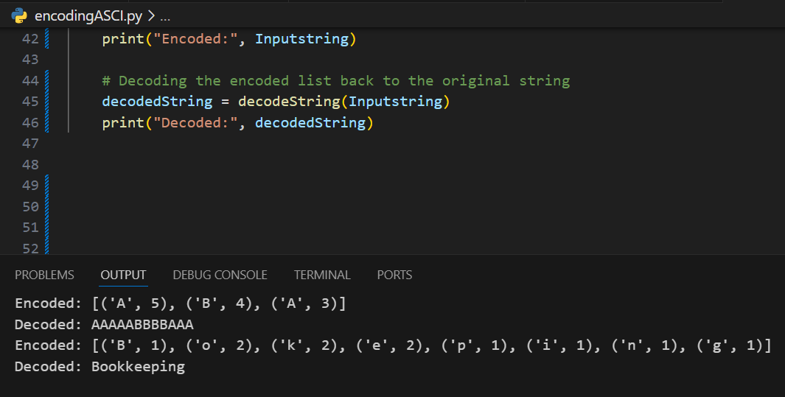

# Encoding ASCII Art with Run-Length Encoding

Run-length encoding (RLE) is a simple compression technique where consecutive repeated characters are stored as a single character followed by the number of occurrences. This can significantly reduce the size of strings that contain repeated characters.

## Task Description

### `encodeString`
This function takes a string and returns a list of tuples. Each tuple contains a character and the number of times that character appears consecutively in the string.

**Example:**

```python
encodeString("AAAAABBBBAAA")
```
**Result:**

```python
[('A', 5), ('B', 4), ('A', 3)]
```

### `decodeString`
This function takes a list of tuples (the encoded string) and returns the original string by expanding each tuple into the corresponding number of characters.

**Example:**

```python
decodeString([('w', 5), ('1', 2), ('G', 3)])
```
**Result:**

```python
"wwww11GGG"
```

## Code Implementation

### `encodeString` Function

```python
def encodeString(s):
    encoded = []
    count = 1
    
    # Traverse through the string
    for i in range(1, len(s)):
        if s[i] == s[i - 1]:
            count += 1
        else:
            encoded.append((s[i - 1], count))
            count = 1
    # Adding the last character's count
    encoded.append((s[-1], count))
    
    return encoded
```

### `decodeString` Function

```python
def decodeString(encoded):
    decoded = ''
    for char, count in encoded:
        decoded += char * count
    return decoded
```

## Example Usage

### Encoding Example:

```python
# Example 1
input_string = "AAAAABBBBAAA"
encoded = encodeString(input_string)
print(encoded)
# Output: [('A', 5), ('B', 4), ('A', 3)]

# Example 2
input_string = "Bookkeeping"
encoded = encodeString(input_string)
print(encoded)
# Output: [('B', 1), ('o', 2), ('k', 2), ('e', 2), ('p', 1), ('i', 1), ('n', 1), ('g', 1)]
```

### Decoding Example:

```python
# Example 1
encoded_input = [('w', 5), ('1', 2), ('G', 3)]
decoded = decodeString(encoded_input)
print(decoded)
# Output: "wwww11GGG"
```

## Constraints

- The input string will always be a valid string.
- The encode and decode functions should handle any string input.
## RESULT



---
