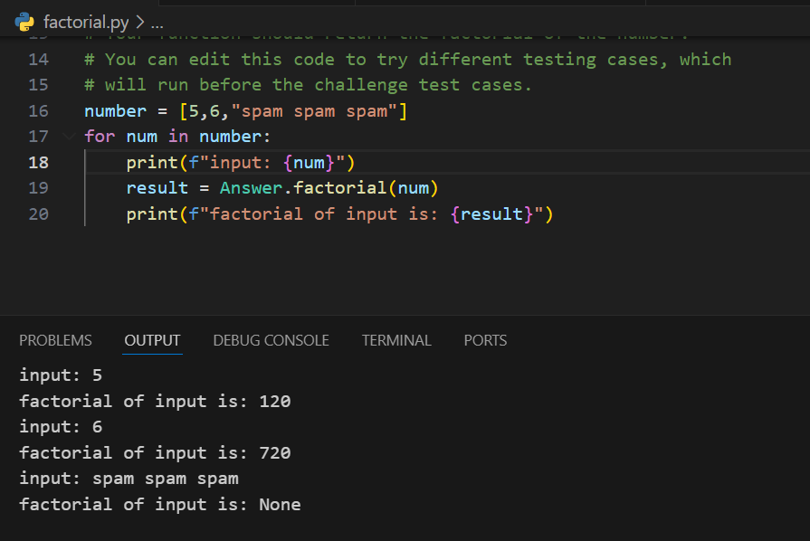

# Factorial Challenge

The **factorial** of a number is that number multiplied by all the positive whole numbers less than it. It is written with an exclamation point, like "n!" (read this as "n factorial").

For a given number \( n \):

\[
n! = n \times (n - 1) \times (n - 2) \times \ldots \times 3 \times 2 \times 1
\]

## Examples

- **5!** = 5 × 4 × 3 × 2 × 1 = 120
- **6!** = 6 × 5 × 4 × 3 × 2 × 1 = 720

### Interesting Fact
The factorial of a number also represents the number of ways to arrange a set of items. For instance, the possible arrangements of a standard deck of playing cards (52 cards) is \( 52! \), which is an astronomically large number!

### Special Case
By convention:
\[
0! = 1
\]

## Task
Write a function called `factorial` that returns the factorial of a given number.

### Parameters
- **`num`**: A non-negative integer (including 0). If the input is not a valid non-negative integer, the function should return `None`.

### Expected Result
The function should return the factorial of the given number.

### Constraints
- If the input is not a positive whole number (or zero), the function should return `None`.

---

## Examples

1. **Input**: `5`  
   **Output**: `120`

2. **Input**: `6`  
   **Output**: `720`

3. **Input**: `'spam spam spam'`  
   **Output**: `None`
## RESULT

)

---
