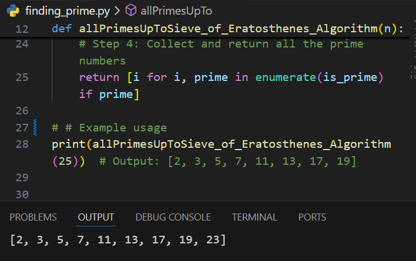

# Faster Prime Finding

Finding prime numbers efficiently is a key challenge in many mathematical and cryptographic applications. A common method to determine if a number is prime is to check if it is divisible by any smaller numbers. However, this can be inefficient if not optimized. 

## Problem Description

We previously used the following method to check if numbers are prime:

```python
for number in range(2, 100):
    for factor in range(2, int(number ** 0.5) + 1):
        if number % factor == 0:
            break
    else:
        print(f'{number} is prime!')
```

### Inefficiencies

This method tests every number up to the square root of the number, but still checks all factors like 4, 6, 8, etc., even though if a number is not divisible by 2, it will not be divisible by any of these numbers. A more efficient approach involves checking only prime factors.

For example, when testing whether `51` is prime:
- **Inefficient method**: Test for divisibility by 2, 3, 4, 5, 6, 7, 8.
- **Efficient method**: We only need to check if it's divisible by the prime numbers `2`, `3`, `5`, and `7`.

### Faster Prime Finding

The goal is to use only prime potential factors, significantly improving performance. Additionally, by maintaining a list of primes up to a certain limit, we can check the primality of numbers much faster.

For instance, when checking `53`, we only need to test it against primes like `2`, `3`, `5`, and `7`. Since the square root of `53` is approximately `7.28`, we don't need to test beyond `7`.

## Task Description

Your task is to implement the function `allPrimesUpTo`, which returns a list of all prime numbers up to the given input number `num`.

### Function: `allPrimesUpTo`

#### Parameters:
- `num`: A positive whole integer (greater than 1).

#### Returns:
- A list of all integer primes less than `num`.

### Constraints:
- No need to check inputs, the input will always be a valid positive integer.

### Examples

#### Example 1:
**Input:**
```python
allPrimesUpTo(10)
```

**Result:**
```python
[2, 3, 5, 7]
```

#### Example 2:
**Input:**
```python
allPrimesUpTo(200)
```

**Result:**
```python
[2, 3, 5, 7, 11, 13, 17, 19, 23, 29, 31, 37, 41, 43, 47, 53, 59, 61, 67, 71, 73, 79, 83, 89, 97, 101, 103, 107, 109, 113, 127, 131, 137, 139, 149, 151, 157, 163, 167, 173, 179, 181, 191, 193, 197, 199]
```

## Optimized Approach

The task involves finding all prime numbers up to a given number efficiently. You can explore more advanced algorithms like the **Sieve of Eratosthenes** to optimize this further and reduce the computational time for larger numbers.

For additional reading, see more about **Sieve of Eratosthenes** and prime number algorithms.

## RESULT
