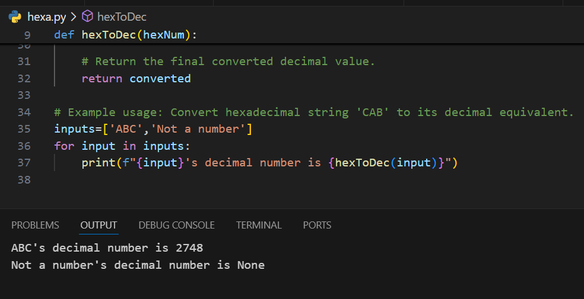

# Convert Hexadecimal to Decimal

Hexadecimal, or **"base 16,"** uses all the numbers 0-9, plus the letters A-F to represent higher numbers:

- **A = 10**
- **B = 11**
- **C = 12**
- **D = 13**
- **E = 14**
- **F = 15**

### Background
The hexadecimal system is often used in computing because it is more compact than binary. Each hexadecimal digit represents four binary digits (bits), making it a shorthand representation of binary-coded values.

For more information and background on the hexadecimal numbering system, you can watch a relevant video on the topic.

### Understanding Hexadecimal
For example:
- The hexadecimal number **2A** represents the decimal number **42**.
  
  **Why?**
  - The calculation is:
    \[
    2A_{16} = (2 \times 16^1) + (10 \times 16^0) = 32 + 10 = 42
    \]

---

## Task

Write a function that converts a **hexadecimal string (up to three characters long)** into a decimal integer. However, **do not** use Python's built-in `int(hexNum, 16)` function. Instead, write your own conversion logic.

### Parameters
- **`hexNum`**: A string representing a hexadecimal value that needs to be converted to decimal. The string should be up to **three characters long**.

### Result
- The function should return an **integer** representing the decimal equivalent of the hexadecimal input.
- If the input is not a valid hexadecimal value, it should return **None**.

---

## Examples

1. **Input**: `'ABC'`  
   **Output**: `2748`

   **Explanation**:  
   \[
   ABC_{16} = (10 \times 16^2) + (11 \times 16^1) + (12 \times 16^0) = 2560 + 176 + 12 = 2748
   \]

2. **Input**: `'Not a number'`  
   **Output**: `None`

   **Explanation**: The input string is not a valid hexadecimal number.

---

## Result

---
