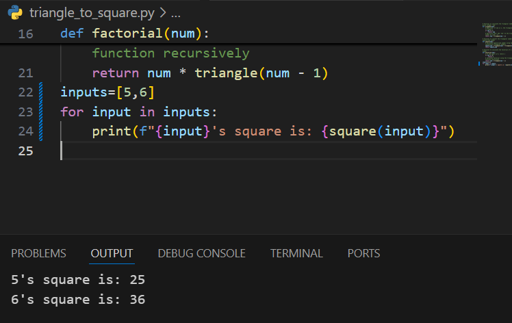

# Sum of Triangles

## Problem Description

You are given a function `triangle(num)` that returns the **triangular number** for a given integer `num`. Your goal is to use this function to create another function `square(num)` that returns the **square** of the given positive integer `num`, without using multiplication or exponents.

### What are Triangular Numbers?

A **triangular number** is the sum of all integers from 1 to `num`. For example:

- `triangle(3)` = `3 + 2 + 1 = 6`
- `triangle(4)` = `4 + 3 + 2 + 1 = 10`

These numbers are called **triangular numbers** because you can arrange a count of objects (like marbles) in a triangular shape. For example, 10 marbles can be arranged as:

```
#
##
###
####
```

### What are Square Numbers?

A **square number** is the number obtained by multiplying an integer by itself (for example, `n^2`). A number is a square if you can take the square root of it and get a whole integer (e.g., 25, 36, 49, etc.).

### Task

Your task is to implement the `square(num)` function that returns the square of a number using the `triangle(num)` function. You are not allowed to use multiplication or exponentiation.

### Example 1

**Input:**

```python
square(5)
```

**Output:**

```python
25
```

### Example 2

**Input:**

```python
square(6)
```

**Output:**

```python
36
```

## Function Signature

```python
def triangle(num: int) -> int:
    # Returns the triangular number for num.
    pass

def square(num: int) -> int:
    # Returns the square of num using the triangle function.
    pass
```

## Constraints

- `num` is a positive integer.
- You are required to use the `triangle` function to calculate the square.

## Approach

You can leverage the properties of triangular numbers to compute the square. Remember that triangular numbers grow as the sum of consecutive integers, and you'll need to use recursion to compute these sums.

For additional information on recursion and mathematical concepts like triangular and square numbers, consider reading further on recursion techniques and number theory.
## Result

